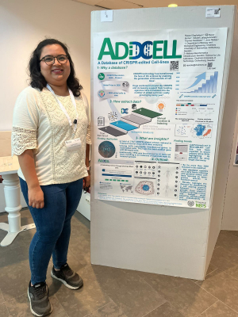

Over the course of two days in [CRISPR as a research tool in cancer and regenerative medicine](https://www.scilifelab.se/event/crispr-as-a-research-tool-scilifelab-international-symposium/), a gathering was held that brought together prominent international experts specializing in CRISPR technology and its applications in fundamental cancer research and regenerative medicine. Attendees had the chance to delve into a more comprehensive comprehension of CRISPR's capabilities and constraints as a research instrument. This encompassed its role in precise genome editing, as well as its application in extensive functional genomics studies and impartial screenings. Additionally, we showcased the latest advancements in our AddCell project during this conference.

Thanks to [Nupur](https://www.linkedin.com/in/nupur-kumar-32579539/) for presenting us there!
